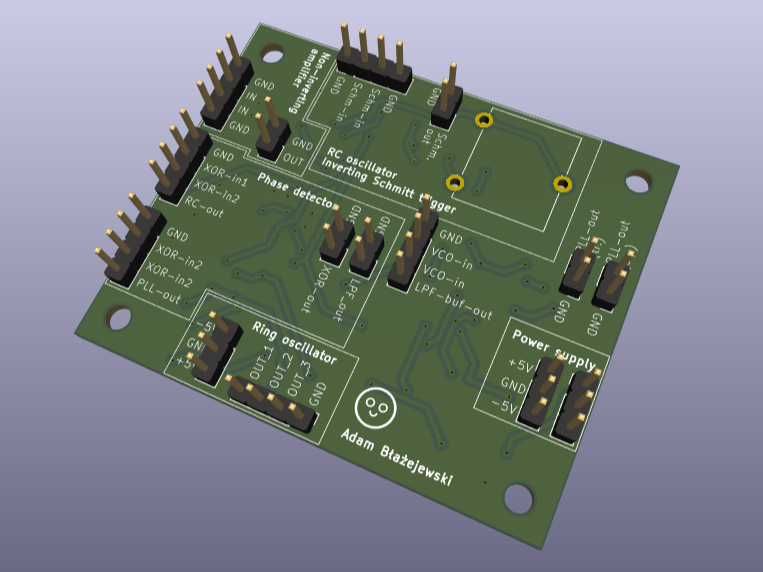
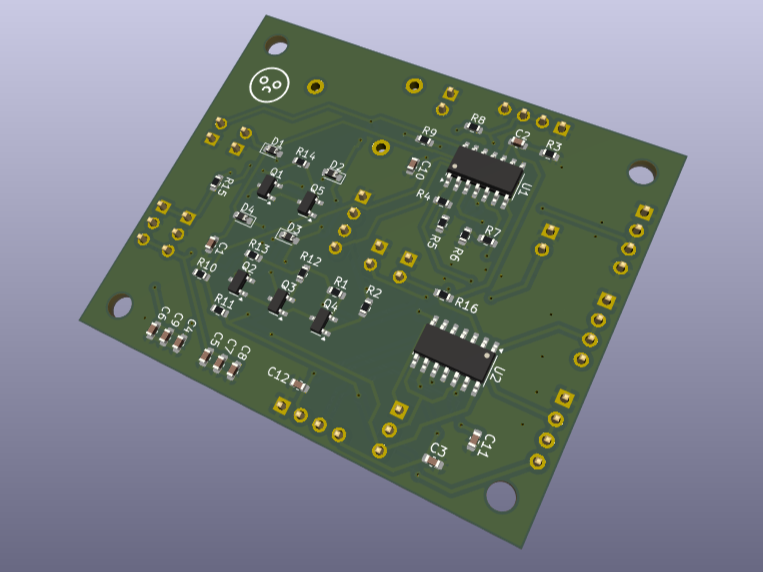
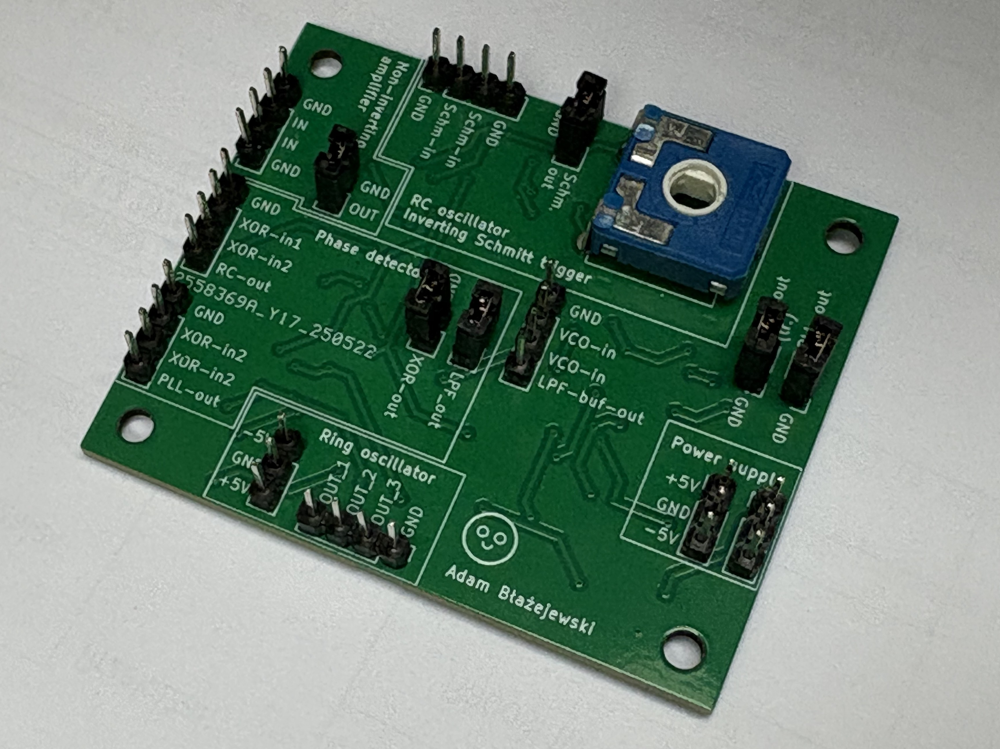
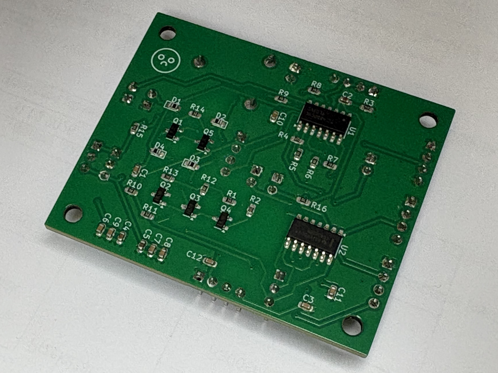
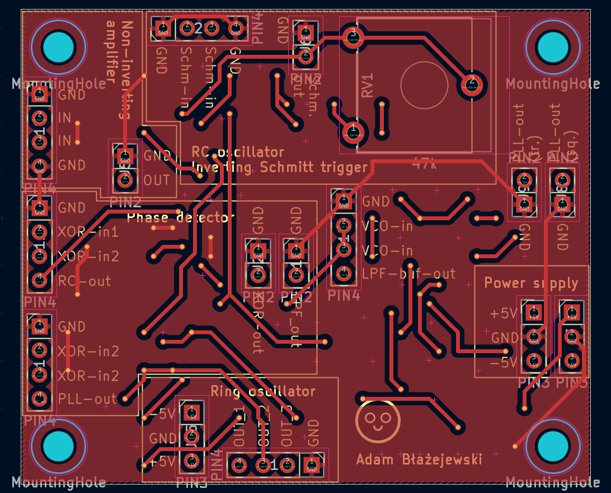
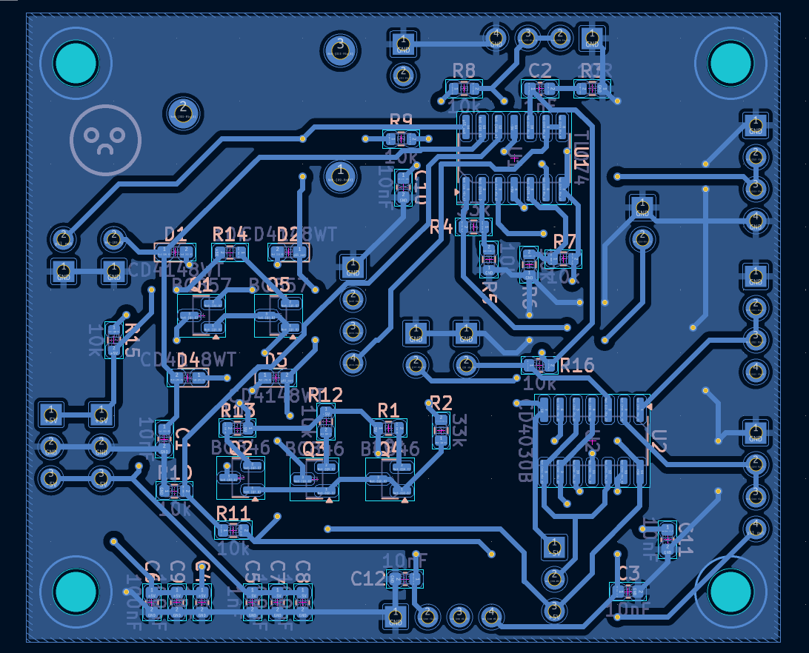
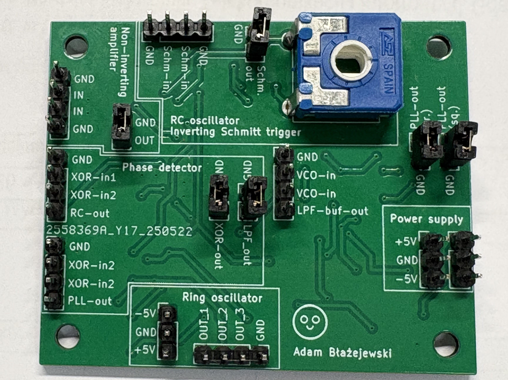
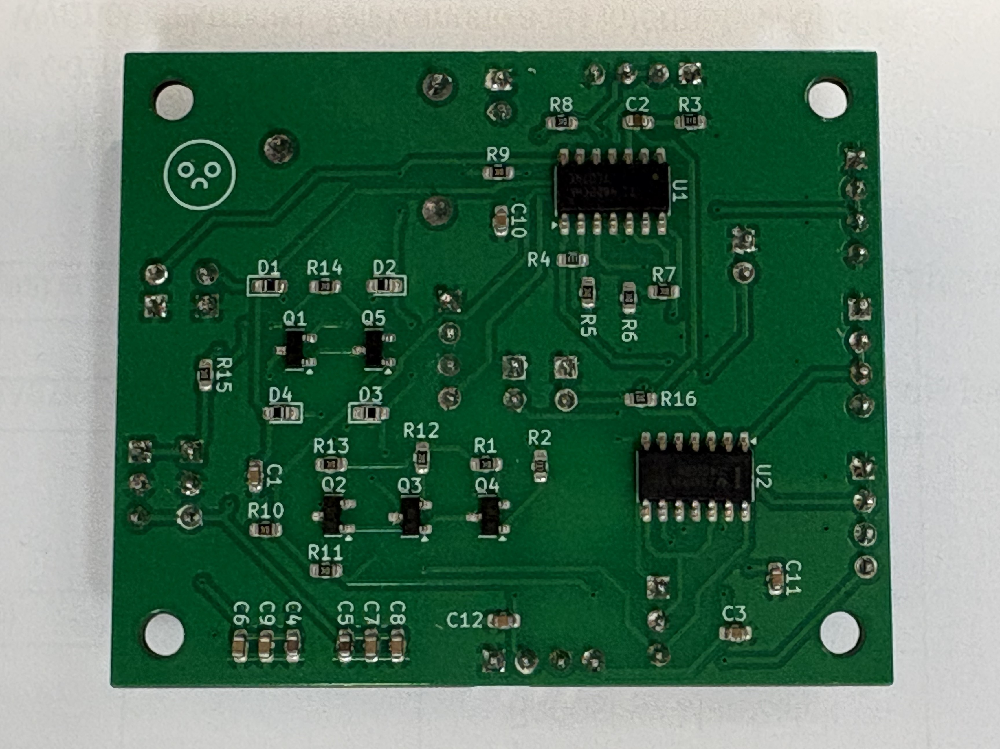
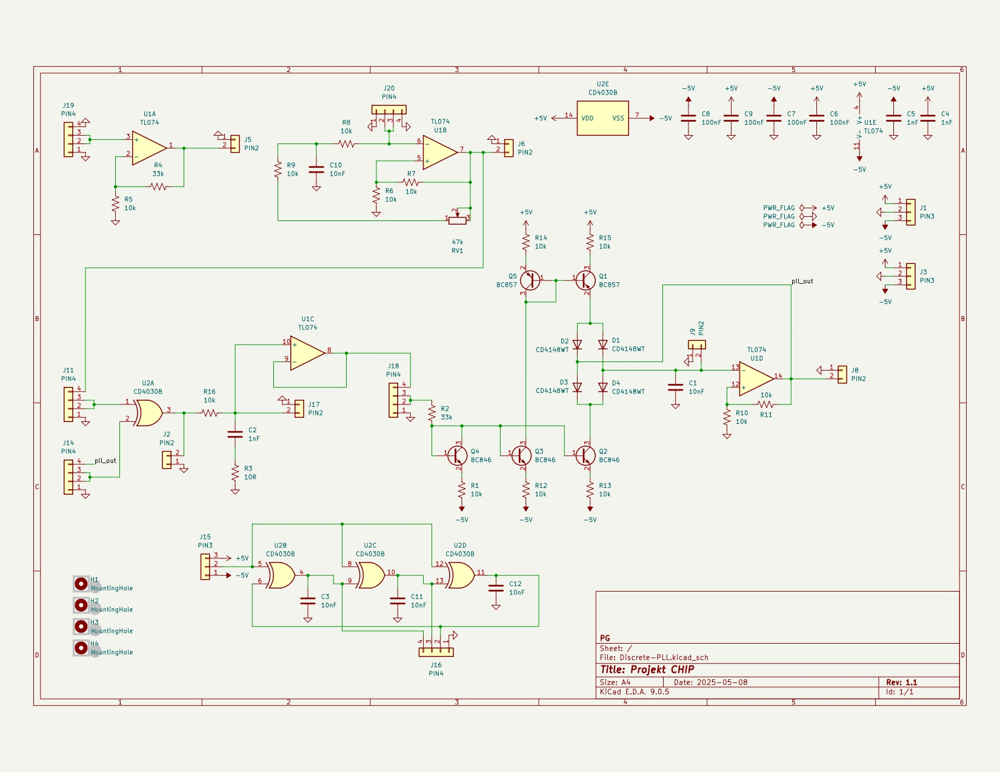

# Discrete-PLL: From Schematic to 3D Printed Case

Electronics project featuring a **Discrete Phase-Locked Loop (PLL)**.

### pcb photos and renders:

  
  

  
  

### pcb layout:

  
  

  
  

### circuit diagram:

  

## Project Scope
* **Design:** Analog-digital schematic and custom PCB layout in **KiCad**.
* **Hardware:** Discrete architecture utilizing **CD4030B** XOR gates and **TL074** op-amps.
* **Assembly:** Hand-soldered board featuring **BC846/857** transistor pairs.

## Repository Structure
* `/KiCad-files` – Schematic and PCB source files.
* `/gerbers` – Manufacturing data (Gerber and Drill files).
* `/images` – PCB renders, schematic exports, and project photos.
* `schematic.pdf` – Full circuit diagram.